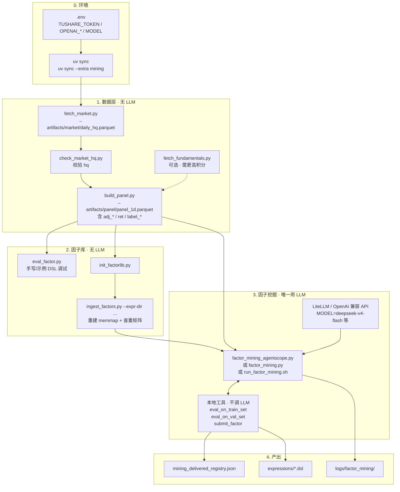
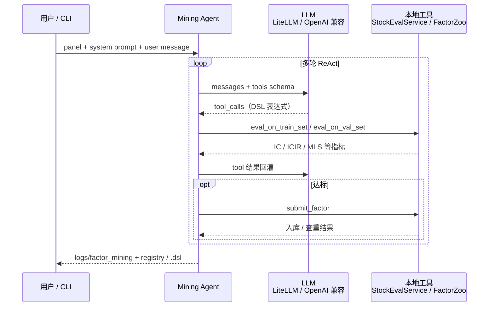

# AlphaAgent 操作手册

> 按**推荐执行顺序**整理：环境 → 拉数据 / 建 Panel（含 label）→ 因子调试 → 建因子库 → 入库 / 查重 → Panel 更新与 realign → LLM 挖因子。  
> 所有命令均在**仓库根目录**执行，前缀统一为 `uv run python scripts/...`。

---

## 全流程总览（Mermaid）

数据与因子库是本地计算；**只有「因子挖掘」阶段会调 LLM**（经 OpenAI 兼容网关 / LiteLLM）。



### LLM 用在哪里

| 阶段 | 是否调 LLM | 说明 |
|------|------------|------|
| `fetch_market` / `build_panel` | 否 | 只拉数、建表 |
| `eval_factor` / `init_factorlib` / `ingest` | 否 | 本地 DSL 求值与入库 |
| **`factor_mining_*.py`** | **是** | 模型提出/改写因子表达式，并发起 tool_calls |
| `eval_on_train_set` / `eval_on_val_set` | 否 | 工具在本地算 IC/ICIR/MLS |
| `submit_factor` | 否 | 本地查重 + 写入 FactorZoo |

挖掘会话内部循环：



入口对照：

| 入口 | LLM 配置 | 备注 |
|------|----------|------|
| `scripts/run_factor_mining.sh` | 默认 `OPENAI_API_BASE=https://litellm.spaccez.com/v1` | 推荐 |
| `scripts/factor_mining_agentscope.py` | `.env` 的 `OPENAI_API_KEY` / `BASE` / `MODEL` | 流式 |
| `scripts/factor_mining.py` | 同上 | OpenAI SDK 直连 |

你当前进度（已有约 1 个月 `daily_hq`）→ 接着：多年 `fetch_market` → `build_panel` → `init_factorlib` + `ingest` → mining。

---

## 0. 环境准备

### 0.1 安装依赖

```powershell
cd D:\AlphaAgent2026
uv sync
```

可选能力：

| extra | 用途 | 命令 |
|-------|------|------|
| `dev` | pytest（默认已装） | — |
| `mining` | LLM 因子挖掘 | `uv sync --extra mining` |

### 0.2 配置 `.env`

在项目根目录创建 `.env`：

```env
# 拉行情 / 基本面（仅 fetch_* / update_panel；已有 panel 或开源包可不填）
TUSHARE_TOKEN=your_tushare_token
TUSHARE_HTTP_URL=https://tushare.citydata.club

# 因子挖掘必填（仅 mining 脚本；可用 LiteLLM 网关）
OPENAI_API_KEY=sk-...
OPENAI_API_BASE=https://litellm.spaccez.com/v1
MODEL=deepseek-v4-flash
MAX_PARALLEL_EVAL=4           # 可选，train/val 并行评估上限（默认 1；也可用 --max-parallel-eval 覆盖）
```

### 0.3 关键路径（默认值）

| 路径 | 说明 |
|------|------|
| `artifacts/panel/panel_1d.parquet` | 日频 Panel（量价 + label；可选 `funda_*` 基本面列） |
| `artifacts/fundamental/quarterly.parquet` | 季频财务指标缓存（全市场 VIP 拉取） |
| `artifacts/fundamental/disclosure_calendar.parquet` | 财报披露日历（PIT 生效日） |
| `artifacts/factorzoo/stock_1d/` | 因子库（本地 memmap；**Git 仅同步** `expressions/*.dsl` 等少量元数据） |
| `artifacts/factorzoo/stock_1d/expressions/` | 已入库因子 DSL（**进 Git**，协作用源码） |
| `examples/factors/*.dsl` | 示例 / 手写 DSL（未入库） |
| `logs/factor_mining/` | 挖掘会话日志 |

### 0.4 默认评估口径

| 项 | 默认值 |
|----|--------|
| label（脚本默认） | `label_1d_open_to_open`（T+1 开盘 → T+2 开盘收益） |
| train | 2019-01-01 ~ 2021-12-31 |
| val | 2022-01-01 ~ 2024-12-31 |
| 截面查重阈值 | `\|cs_corr\| < 0.8` |

**`--label-col` 选用建议**（评估 / 挖掘时显式指定）：

| 因子类型 | 推荐 label |
|----------|------------|
| 基本面（主要用 `funda_*`） | `label_10d_close_to_close` |
| 价量（OHLC / `ret` / `volume` / 筹码等） | `label_1d_close_to_close` |

指标含义见 [factor_metrics.md](./factor_metrics.md)。

---

## 1. 拉数据 & 建 Panel（含 label）

Panel 构建时会**自动**写入行情、复权 OHLC、`ret` 与两个前瞻 label，**无需单独建 label 脚本**。

| 列 | 含义 |
|----|------|
| `label_1d_open_to_open` | `(adj_open[t+2] - adj_open[t+1]) / adj_open[t+1]` |
| `label_{N}d_close_to_close` | `(adj_close[t+N+1] - adj_close[t+1]) / adj_close[t+1]`，如 `label_10d_close_to_close` = T+1 close → T+11 close |
| `ret` | 按 instrument 的 adj_close 日收益 |
| `adj_*` | 后复权 OHLC；`adj_vwap = vwap × adjfactor` |

### 1.1 全量构建（ZZ1000 成分并集，推荐）

两段式：**先拉行情落盘 hq 缓存（联网），再离线建 panel（不联网）**。

```powershell
# 1. 拉行情 → artifacts/market/daily_hq.parquet
uv run python scripts/fetch_market.py --start 2015-01-01 --end 2026-06-30 --universe zz1000
# 2. 从 hq 缓存离线构建 panel
uv run python scripts/build_panel.py
```

输出默认：`artifacts/panel/panel_1d.parquet`。

常用参数：

```powershell
# 降低 Tushare 限流风险（大批量建议 batch-size 20~40）
uv run python scripts/fetch_market.py --start 2024-01-01 --end 2024-12-31 --batch-size 20 --sleep 0.35

# 全市场按日拉取（慢）
uv run python scripts/fetch_market.py --start 2024-01-01 --end 2024-01-31 --universe none

# 从 hq 缓存切片构建、指定输出
uv run python scripts/build_panel.py --start 2024-01-01 --end 2024-12-31 --out artifacts/panel/panel_1d.parquet
```

### 1.2 增量更新

一条命令：增量拉取新交易日 → 追加 hq 缓存 → panel 尾部 merge + 回填 `ret` / label：

```powershell
uv run python scripts/update_panel.py --universe zz1000 --with-fundamentals --with-industry
```

指定若干交易日：

```powershell
uv run python scripts/update_panel.py --dates 2026-06-27 2026-06-30 --universe zz1000
```

已有 panel 补算新 label 列（schema 升级后一次性执行）：

```powershell
uv run python -c "from alphaagent.core.paths import PANEL_PATH; from alphaagent.data.panel import load_panel, save_panel, backfill_panel_derived_columns; p = backfill_panel_derived_columns(load_panel(PANEL_PATH)); save_panel(p, PANEL_PATH); print('ok', [c for c in p.columns if c.startswith('label_')])"
```

评估时按因子类型指定 `--label-col`：

```powershell
# 基本面
uv run python scripts/eval_factor.py --expr-file your.dsl --report --label-col label_10d_close_to_close
# 价量
uv run python scripts/eval_factor.py --expr-file your.dsl --report --label-col label_1d_close_to_close
```

### 1.4 季频基本面（PIT 展开）

季频 `fina_indicator` 单独缓存，Panel enrich 时按**披露日 T+1 交易日**严格 PIT 展开为日频 `funda_*` 列（与 AlphaAgent 语义一致）。

**推荐流程（全市场缓存 + zz1000 panel）：**

```powershell
# 1. 拉季频（VIP 每期 1 次请求，全 A 股落盘；每期 merge 后立即写盘）
uv run python scripts/fetch_fundamentals.py --start 2015-01-01 --end 2026-12-31

# 积分不足时逐股慢拉（须指定 universe）
uv run python scripts/fetch_fundamentals.py --start 2015-01-01 --end 2026-12-31 --universe zz1000 --no-vip

# 2a. 从 hq 缓存离线建 panel 时一并 enrich
uv run python scripts/build_panel.py --with-fundamentals

# 2b. 已有 panel，仅补基本面列（不重建量价）
uv run python scripts/build_panel.py --enrich-only

# 2c. 增量更新行情后顺带 refresh 基本面
uv run python scripts/update_panel.py --universe zz1000 --with-fundamentals
```

| 参数 | 说明 |
|------|------|
| `--with-fundamentals` | 构建/更新后 PIT 并入 `funda_*` |
| `--enrich-only` | 只读已有 panel + 本地 fundamental 缓存 enrich |
| `--no-disclosure-distance` | 不写入 `funda_days_since_disclose` 等披露距离列 |

**Panel 内基本面列（当前，`fina_indicator`）：**  
`funda_roe`、`funda_roa`、`funda_debt_to_assets`、`funda_eps`、`funda_bps`、`funda_netprofit_yoy`、`funda_or_yoy`、`funda_grossprofit_margin`、`funda_fs_working_capital`、`funda_fs_ebit` 等；披露特征 `funda_days_since_disclose`、`funda_days_since_quarter_start`。  
挖掘 agent 系统提示词已包含字段说明。

**label 选用**：基本面因子 `--label-col label_10d_close_to_close`；价量因子 `--label-col label_1d_close_to_close`。

**三大表（可选）**：`fetch_fundamentals.py --with-statements` 额外拉 income/balancesheet/cashflow，并入 `funda_fs_*` 列（利润表/现金流为年初至今累计，列名带 `_ytd`；资产负债表为时点值）。

**行业分类（可选）**：`build_panel.py --with-industry` 并入申万一级行业码 `industry_sw_l1`（严格 PIT，缓存于 `artifacts/industry/`）。DSL 里 `CS_NEUTRALIZE($factor, $industry_sw_l1)` 做行业中性。详见 `docs/panel_fundamental_fields.md` §3.4。

### 1.5 Panel 复权修补（可选）

全量 rebuild 后通常不需要；发现 adjfactor 断层时可用 `market_fetch.repair_panel_adjfactor`（联网单股重拉 adj_factor 并重算）：

```powershell
uv run python -c "from alphaagent.core.paths import PANEL_PATH; from alphaagent.data.panel import load_panel, save_panel; from alphaagent.data.market_fetch import repair_panel_adjfactor; p, stats = repair_panel_adjfactor(load_panel(PANEL_PATH)); print(stats); save_panel(p, PANEL_PATH)"
```

---

## 2. 因子表达式调试（不入库）

在入库或挖掘前，先用 `eval_factor.py` 验证 DSL 能否跑通、看 IC 报告。

### 2.1 只看求值结果（coverage + 样本）

```powershell
uv run python scripts/eval_factor.py --expr-file examples/factors/ma20_dev.dsl
```

PowerShell 内联表达式请用**单引号**，避免 `$` 被 shell 吃掉：

```powershell
uv run python scripts/eval_factor.py --expr 'SUBTRACT($adj_close, TS_MEAN($adj_close, 20))'
```

### 2.2 IC / ICIR / RANKIC / MLS 报告

```powershell
uv run python scripts/eval_factor.py --expr-file examples/factors/ma_dev.dsl --report
```

指定 label 与评估区间（DSL 仍在**全量 panel** 上求值，`--start-time` 只切 metrics）：

```powershell
uv run python scripts/eval_factor.py --expr-file examples/factors/ma_dev.dsl --report `
  --label-col label_1d_open_to_open `
  --start-time 2019-01-01 --end-time 2021-12-31
```

JSON 输出（便于脚本解析）：

```powershell
uv run python scripts/eval_factor.py --expr-file examples/factors/ma_dev.dsl --report --json
```

---

## 3. 初始化因子库（factorzoo）

**前提**：已有与目标研究一致的 Panel 文件。

```powershell
uv run python scripts/init_factorlib.py
```

默认绑定：

- Panel：`artifacts/panel/panel_1d.parquet`
- 因子库：`artifacts/factorzoo/stock_1d/`

自定义：

```powershell
uv run python scripts/init_factorlib.py `
  --panel artifacts/panel/panel_1d.parquet `
  --output artifacts/factorzoo/stock_1d `
  --n-sample-rows 200000 `
  --max-factors 2048
```

成功后会生成 `manifest.json`、`index/shards.json`、相似度矩阵占位等。**同一 Panel 只需 init 一次**；Panel 行数变更后应走 [第 5 节 realign](#5-panel-更新后-realign-因子库)，而不是重复 init 覆盖。

---

## 4. 因子入库（手动）

### 4.1 单文件入库

```powershell
uv run python scripts/ingest_factors.py --expr-file examples/factors/ma20_dev.dsl
```

指定 ID / 名称：

```powershell
uv run python scripts/ingest_factors.py `
  --expr-file examples/factors/ma20_dev.dsl `
  --factor-id ma20_dev `
  --name "20日均线偏离"
```

### 4.2 按 registry 批量入库

编辑 `configs/factors/registry.example.json` 后：

```powershell
uv run python scripts/ingest_factors.py --registry configs/factors/registry.example.json
```

只入库其中一个：

```powershell
uv run python scripts/ingest_factors.py --registry configs/factors/registry.example.json --factor-id ma_dev
```

### 4.3 查重与 dry-run

入库前**自动截面查重**：与库内已有因子逐日截面 Pearson 相关均值，`|corr| ≥ 0.8` 拒绝。

```powershell
# 只算指标 + 查重，不写库
uv run python scripts/ingest_factors.py --expr-file examples/factors/ma20_dev.dsl --dry-run

# 调整查重阈值 / top 邻居数
uv run python scripts/ingest_factors.py --expr-file examples/factors/ma20_dev.dsl --max-cs-corr 0.75 --similar-top-k 5
```

覆盖已存在 factor_id：

```powershell
uv run python scripts/ingest_factors.py --expr-file examples/factors/ma20_dev.dsl --overwrite
```

### 4.4 查看因子库

```powershell
# 列表
uv run python scripts/factorlib_info.py

# 单个因子详情（含 expr）
uv run python scripts/factorlib_info.py --factor-id ma20_dev

# JSON
uv run python scripts/factorlib_info.py --json
```

### 4.5 从 Git 的 `.dsl` 全量重建因子库（memmap + 查重矩阵）

**背景**：Git **只同步** `artifacts/factorzoo/stock_1d/expressions/*.dsl`（及可选的 `mining_delivered_registry.json` 等），**不同步** memmap 数值、`similarity/` 相关矩阵、`meta/factors.parquet` 等（见根目录 `.gitignore`）。

因此协作者 `git clone` / `git pull` 之后，本地只有表达式源码，**还没有**可用于：

- `submit_factor` / `ingest_factors.py` 的**截面查重**（与库内因子算 `\|cs_corr\|`）
- `factorlib_info.py` 查看已入库因子列表
- LLM 挖掘时 `similarity.top_neighbors` 返回相似因子

查重依赖 **`values/*.memmap` 里的全量因子值** 和 **`similarity/pearson.f32.memmap`**，必须从 `.dsl` **重新物化入库** 才能恢复。

#### 两个方向

| 方向 | 命令 | 何时用 |
|------|------|--------|
| **导出**（zoo → `.dsl`，准备 commit） | `sync_factor_exprs.py` | 本地挖掘/入库后，把 catalog 同步到 `expressions/` 再 `git push` |
| **导入**（`.dsl` → zoo 全量值） | `ingest_factors.py --expr-dir ...` | clone / pull 后，从 Git 里的 `.dsl` 重建 memmap + 查重矩阵 |

#### 首次 clone / pull 后：全量重建（推荐）

**前提**：已有与团队一致的 Panel（`artifacts/panel/panel_1d.parquet`），且行数与 `init_factorlib` 时绑定的一致。

```powershell
# 1. 拉代码后确认 expressions 已在
dir artifacts\factorzoo\stock_1d\expressions\*.dsl

# 2. 若 factorzoo 尚未初始化（无 manifest.json）
uv run python scripts/init_factorlib.py

# 3. 从 expressions 批量物化入库（重建 values + similarity + catalog）
uv run python scripts/ingest_factors.py `
  --expr-dir artifacts/factorzoo/stock_1d/expressions `
  --overwrite

# 4. 确认因子数与 Git 中 .dsl 数量一致
uv run python scripts/factorlib_info.py
```

说明：

- `--expr-dir`：扫描目录下全部 `*.dsl`，`factor_id` = 文件名（不含扩展名）。
- `--overwrite`：已存在同 id 因子时用新表达式重算并覆盖（pull 后建议加上，保证与 Git 一致）。
- 首次空库可不写 `--overwrite`；pull 更新已有因子时**建议始终加**。
- 入库过程会逐因子 DSL 求值 → 写 memmap → 更新截面相似度矩阵，**查重能力随之恢复**。

#### 仅增量同步（同事新提交了少量因子）

```powershell
git pull
# 只入库新增 .dsl（不覆盖已有）
uv run python scripts/ingest_factors.py --expr-dir artifacts/factorzoo/stock_1d/expressions

# 若某因子表达式被修改，单独覆盖：
uv run python scripts/ingest_factors.py `
  --expr-file artifacts/factorzoo/stock_1d/expressions/new_factor.dsl `
  --overwrite
```

#### 提交侧：入库 / 挖掘后推送到 Git

```powershell
# 挖掘 submit 成功或手动 ingest 后，导出 DSL（与 catalog 对齐）
uv run python scripts/sync_factor_exprs.py

git add artifacts/factorzoo/stock_1d/expressions/*.dsl
git commit -m "sync factor expressions"
git push
```

#### 与「挖因子 + 查重」的关系

开始 LLM 挖掘**之前**，请确认本地 factorzoo 已按上一节重建完毕：

```powershell
uv run python scripts/factorlib_info.py
# n_factors 应 > 0，且与 expressions/*.dsl 数量一致
```

否则 `submit_factor` 可能：

- 库为空 → 查重跳过，误把与已有 Git 因子重复的表达式当作新因子；
- 库过期 → `\|cs_corr\|` 与团队不一致，协作混乱。

**推荐顺序**：`git pull` → `ingest --expr-dir --overwrite` → 再跑 `factor_mining_agentscope.py`。

### 4.6 更新手改过的 `.dsl` 因子

手动编辑并用 `eval_factor.py`（[§2](#2-因子表达式调试不入库)）验证过某个 `.dsl` 后，用 `ingest_factors.py --overwrite` 把新表达式写回 factorzoo（重算 memmap 值 + 指标 + 相似度）。

```powershell
# 1. 先 dry-run 看指标，确认能跑通
uv run python scripts/ingest_factors.py `
  --expr-file artifacts/factorzoo/stock_1d/expressions/<factor_id>.dsl `
  --factor-id <factor_id> `
  --dry-run

# 2. 确认无误后正式覆盖
uv run python scripts/ingest_factors.py `
  --expr-file artifacts/factorzoo/stock_1d/expressions/<factor_id>.dsl `
  --factor-id <factor_id> `
  --overwrite
```

要点：

- **必须加 `--overwrite`**。否则命中已存在因子会直接跳过（`skipped_reason=already_exists`），指标算完但不写库。
- **`--factor-id` 要与 catalog 中已有 ID 完全一致**。不传时会用文件名 stem 经 slug（转小写/替换特殊字符）推导，万一对不上会当成**新因子插入**而非覆盖；稳妥起见显式传。
- **覆盖不走查重闸门**。overwrite 分支调用 `zoo.overwrite_factor`，重新物化 + 重算指标/相似度并覆盖，**不会**因 `max_cs_corr` 过高被拦；只要 DSL 能求值即可更新。
- **指标口径保持一致**。若在意前后可比，`--label-col` / `--train-start` / `--eval-end` 用与初次入库相同的值。
- `ingest_factors.py` **只读** `.dsl`、不回写，手改文本会原样保留；catalog 里存的是物化值，覆盖时按当前 panel 重新求值。
- 更新后如需同步到 Git，走 [§4.5 提交侧](#45-从-git-的-dsl-全量重建因子库memmap--查重矩阵)：`sync_factor_exprs.py`（可选，DSL 已是最新）→ `git add/commit/push`。

---

## 5. Panel 更新后 realign 因子库

Panel 增量更新后，已有因子 memmap 需与新的 canonical index 对齐：

```powershell
# 1. 更新 Panel（增量拉行情 + panel 增量重建）
uv run python scripts/update_panel.py --universe zz1000

# 2. 增量 realign（默认 T+N 窗口，warmup=240 交易日）
uv run python scripts/realign_factorlib.py
```

其他用法：

```powershell
# 只校验 overlap，不写库
uv run python scripts/realign_factorlib.py --dry-run

# 强制全量重算
uv run python scripts/realign_factorlib.py --full
```

---

## 6. LLM 因子挖掘

### 6.1 安装与配置

```powershell
uv sync --extra mining
```

`.env` 中配置 `OPENAI_API_KEY`、`MODEL`（及可选 `OPENAI_API_BASE`）。

> **挖因子前必读**：[§4.5 从 Git 的 `.dsl` 全量重建因子库](#45-从-git-的-dsl-全量重建因子库memmap--查重矩阵)。  
> `submit_factor` 的截面查重依赖本地 memmap；仅 clone 仓库而不 `ingest --expr-dir`，查重矩阵为空，无法正常协作。

### 6.2 打印系统提示词（检查算子清单 / 门槛）

```powershell
uv run python -c "from alphaagent.factor.mining.prompts import build_system_prompt; print(build_system_prompt())" > logs/mining_system_prompt.md
```

不含算子清单的精简版：

```powershell
uv run python -c "from alphaagent.factor.mining.prompts import build_system_prompt; print(build_system_prompt(include_operator_catalog=False))"
```

### 6.3 AgentScope 版（推荐，终端流式输出）

```powershell
uv run python scripts/factor_mining_agentscope.py --panel artifacts/panel/panel_1d.parquet
```

仅评估、不入库（调试 prompt / 工具链）：

```powershell
uv run python scripts/factor_mining_agentscope.py --panel artifacts/panel/panel_1d.parquet --no-submit
```

只挖价量因子、不载入基本面列（省内存；prompt 也会隐藏 `$funda_*` 字段）：

```powershell
uv run python scripts/factor_mining_agentscope.py --panel artifacts/panel/panel_1d.parquet --no-fundamentals
```

> 接了三大表后 panel 有 70+ 个 `funda_fs_*` 列，全量驻内存较大；挖价量因子时加 `--no-fundamentals`，会话会丢弃所有 `funda_*` 列并从系统提示词中移除基本面字段说明。`factor_mining.py`（OpenAI 直连版）同样支持该开关。

### 6.4 OpenAI 直连版

```powershell
uv run python scripts/factor_mining.py --panel artifacts/panel/panel_1d.parquet
```

### 6.5 常用参数

```powershell
uv run python scripts/factor_mining_agentscope.py `
  --panel artifacts/panel/panel_1d.parquet `
  --seed-factor examples/factors/ma20_dev.dsl `
  --user-message "在种子因子基础上优化 IC 与月度稳健性" `
  --train-start 2019-01-01 --train-end 2021-12-31 `
  --val-start 2022-01-01 --val-end 2024-12-31 `
  --label-col label_10d_close_to_close `
  --max-cs-corr 0.8 `
  --log-dir logs/factor_mining `
  --quiet
```

> Panel 须已 `--with-fundamentals` 或 `--enrich-only` 写入 `funda_*` 列后，agent 方可引用 `$funda_roe` 等变量。

| 参数 | 说明 |
|------|------|
| `--no-submit` | 禁用 `submit_factor`，只跑 train/val eval |
| `--seed-factor PATH [PATH ...]` | 种子 `.dsl`，可多次指定 |
| `--user-file PATH` | 从文件读 user 消息 |
| `--factorlib PATH` | 因子库根目录（默认 `artifacts/factorzoo/stock_1d`） |
| `--ingest-overwrite` | submit 时覆盖已存在 factor_id |
| `--no-operator-catalog` | system prompt 不注入算子清单 |
| `--max-parallel-eval N` | 同时进行的 train/val 评估上限（不传则读环境变量 `MAX_PARALLEL_EVAL`，默认 1）。评估以 numpy/pandas 为主会释放 GIL，放开后可真正并行；建议与 `--max-tool-workers` 匹配 |

### 6.6 挖掘会话里的工具链

| 工具 | 作用 |
|------|------|
| `eval_on_train_set` | train 区间评估（IC、ICIR、MLS-FMB、月度稳健性等） |
| `eval_on_val_set` | val 泛化抽检（须传 `expected_sign`） |
| `submit_factor` | 达标后交付入库（**默认开启**；`--no-submit` 时不可用） |

**交付入库链路**（无 `--no-submit` 时）：

```
submit_factor
  → ingest_factor（物化 + 指标 + 截面查重）
  → factorzoo memmap
  → artifacts/factorzoo/stock_1d/mining_delivered_registry.json
  → artifacts/factorzoo/stock_1d/expressions/{factor_id}.dsl
```

查重失败时 tool 返回 `similarity.top_neighbors`（含相似因子 `expr`），模型可改写后重试。

日志：`logs/factor_mining/run_YYYYMMDD_HHMMSS.jsonl` 及同名的 `.summary.json` / `.messages.json`。

---

## 7. 推荐端到端流程（从零开始）

```powershell
# 0. 环境
uv sync
uv sync --extra mining   # 若要挖因子

# 1. 拉行情 → hq 缓存，再离线建 Panel（含 label）
uv run python scripts/fetch_market.py --start 2015-01-01 --end 2026-06-30 --universe zz1000 --batch-size 20
uv run python scripts/build_panel.py

# 2. 调试一个 DSL
uv run python scripts/eval_factor.py --expr-file examples/factors/ma20_dev.dsl --report

# 3. 初始化因子库（仅首次）
uv run python scripts/init_factorlib.py

# 4. 从 Git expressions 全量重建 memmap（挖因子 / 查重前必做，见 §4.5）
uv run python scripts/ingest_factors.py --expr-dir artifacts/factorzoo/stock_1d/expressions --overwrite
uv run python scripts/factorlib_info.py

# 5. LLM 挖因子（正式交付去掉 --no-submit）
uv run python scripts/factor_mining_agentscope.py --panel artifacts/panel/panel_1d.parquet

# 6. 挖掘/入库后推 Git：sync DSL → commit → push（见 §4.5）
uv run python scripts/sync_factor_exprs.py

# 7. 日常：Panel 增量 → realign
uv run python scripts/update_panel.py --universe zz1000
uv run python scripts/realign_factorlib.py
```

---

## 8. 测试

```powershell
uv run pytest tests/ -q
```

因子 / 挖掘相关：

```powershell
uv run pytest tests/test_factor/ tests/test_dsl/ -q
```

---

## 9. 常见问题

| 现象 | 处理 |
|------|------|
| `未找到 TUSHARE_TOKEN` | 检查根目录 `.env` |
| `panel 行数 != 库 n_rows` | Panel 与 init 时不一致；用全量 panel 或先 `realign_factorlib.py` |
| `factorlib_not_initialized` | 先 `init_factorlib.py` |
| PowerShell 里 `$adj_close` 变 `@adj_close` | 用 `--expr-file`，或单引号包裹 `--expr` |
| 挖掘无 `submit_factor` | 去掉 `--no-submit` |
| clone 后查重不生效 / n_factors=0 | 先 §4.5：`ingest --expr-dir ... --overwrite` 重建 memmap |
| 入库 `cs_corr=0.xx >= 0.8` | 查重拒绝；看返回的 `top_neighbors[].expr` 改写 |
| 入库 `delivery_check_failed` | IC/ICIR/coverage/cs_pearson_autocorr 未达门槛 |

---

## 10. 脚本索引

| 脚本 | 用途 |
|------|------|
| `fetch_market.py` | 拉 Tushare 日频行情 → `artifacts/market/daily_hq.parquet`（hq 缓存） |
| `build_panel.py` | 从 hq 缓存**离线**建 Panel（含 label、`--with-fundamentals`、`--enrich-only`） |
| `update_panel.py` | 增量：拉新交易日 → 追加 hq 缓存 → panel 尾部重建 |
| `fetch_fundamentals.py` | 拉 Tushare 季频 `fina_indicator` → `artifacts/fundamental/` |
| `pack_data_release.py` | 打包 market/fundamental/industry 缓存为可分发数据包 |
| `eval_factor.py` | DSL 调试求值 / IC 报告 |
| `init_factorlib.py` | 初始化 factorzoo |
| `ingest_factors.py` | 手动入库 / **`--expr-dir` 从 .dsl 批量重建 memmap** |
| `factorlib_info.py` | 查看因子库 catalog |
| `realign_factorlib.py` | Panel 变更后对齐已有因子 |
| `factor_mining.py` | LLM 挖掘（OpenAI 直连） |
| `factor_mining_agentscope.py` | LLM 挖掘（AgentScope 流式） |
| `sync_factor_exprs.py` | catalog → `expressions/*.dsl`（commit 前导出） |
